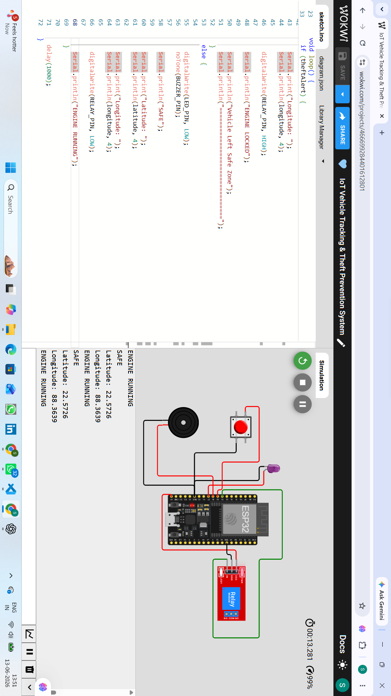
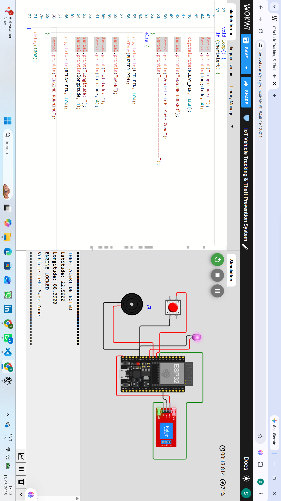
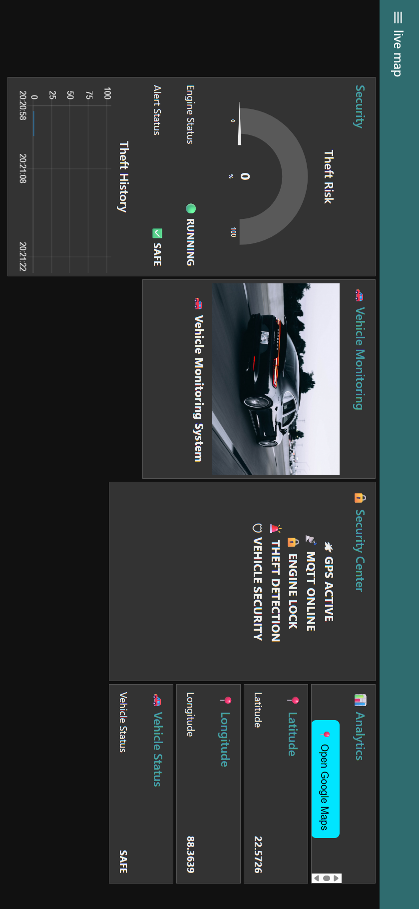
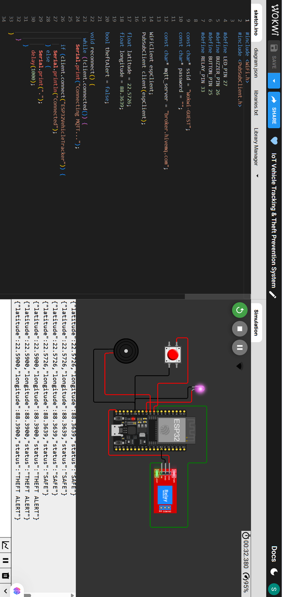
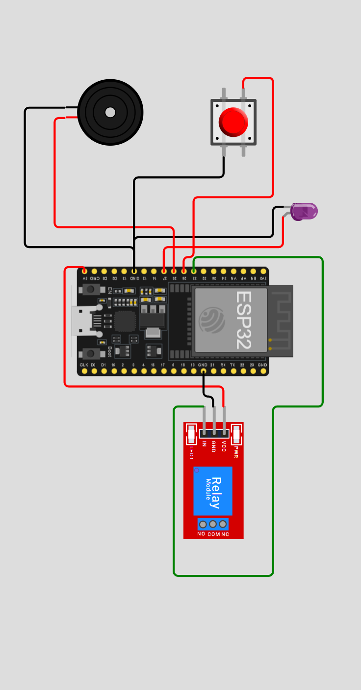
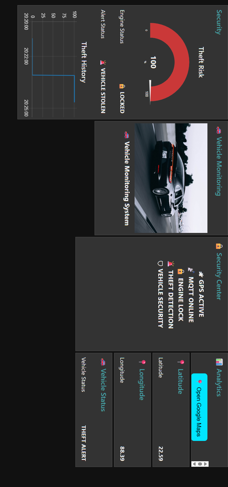
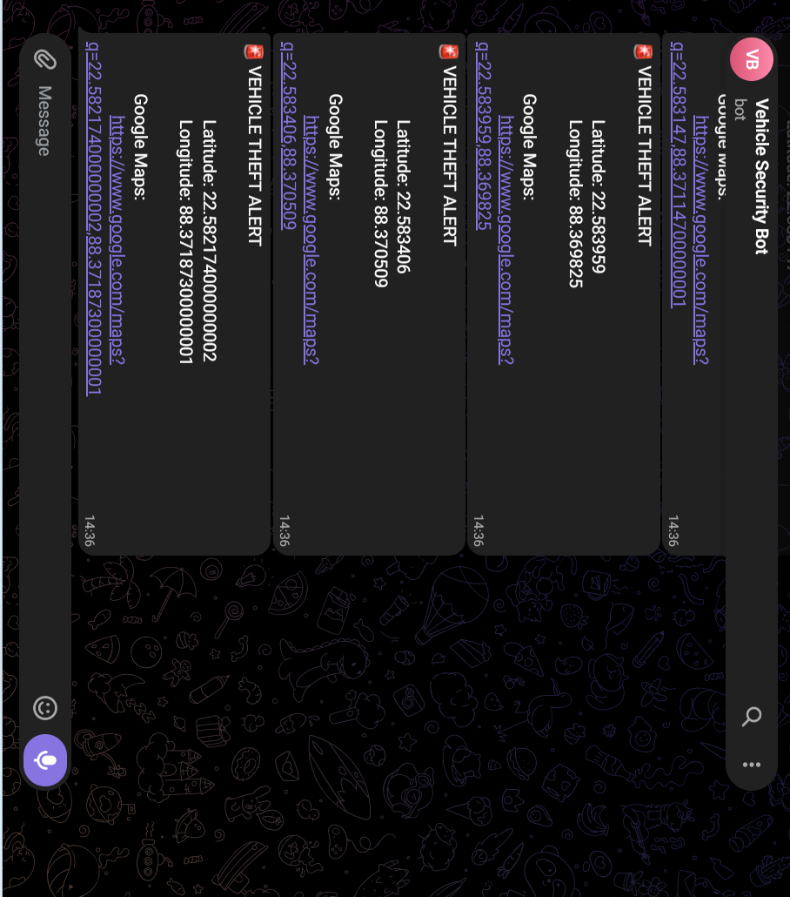
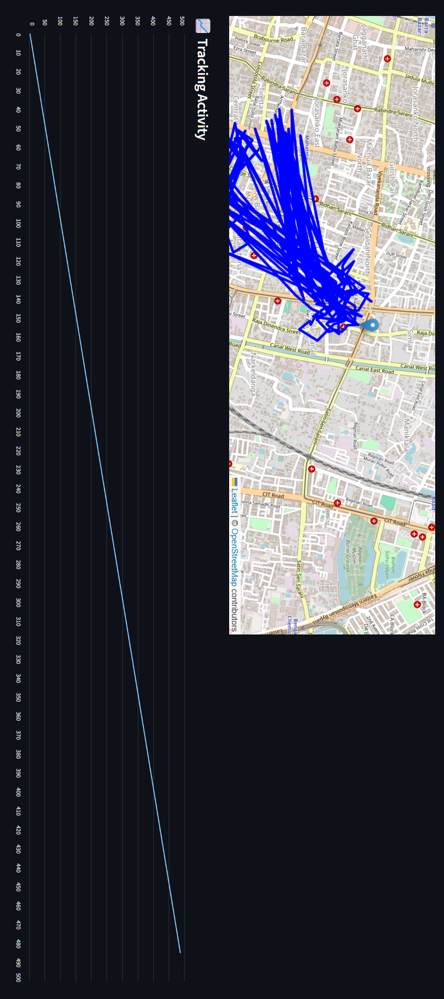
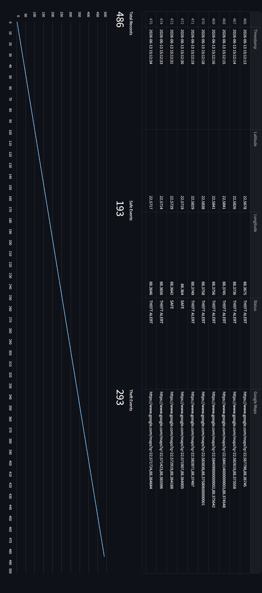

# 🚗 IoT Vehicle Tracking & Theft Prevention System


---

## 🌟 Project Overview

The **IoT Vehicle Tracking & Theft Prevention System** is a smart vehicle security solution developed using **ESP32, MQTT, Python, Firebase, and Node-RED**.

This system continuously monitors vehicle status, tracks location, detects theft attempts, triggers alerts, and visualizes data through a real-time dashboard.

---

## 🎯 Problem Statement

Vehicle theft and unauthorized access remain major concerns.

Traditional tracking systems are often expensive and inaccessible for students and small-scale users.

This project provides a low-cost IoT solution for:

- Real-time vehicle tracking
- Theft detection
- Security monitoring
- Alert generation
- Cloud data storage

---

## 🚀 Features

### 📍 Real-Time Vehicle Tracking
- Live Latitude Monitoring
- Live Longitude Monitoring
- Vehicle Status Updates

### 🔒 Theft Prevention
- Theft Risk Detection
- Vehicle Lock Monitoring
- Security Status Alerts

### ☁️ Cloud Integration
- Firebase Realtime Database
- Cloud Data Storage
- Real-Time Synchronization

### 📡 MQTT Communication
- Publish/Subscribe Architecture
- Real-Time Data Transfer
- Lightweight Communication Protocol

### 📊 Dashboard Monitoring
- Node-RED Dashboard
- Live Vehicle Data
- Security Analytics
- Theft History Visualization

### 📲 Smart Alerts
- Telegram Notifications
- Dashboard Alerts
- Theft Detection Warnings

---

# 🏗️ System Architecture

```text
ESP32
 │
 ▼
MQTT Broker
 │
 ▼
Python Backend
 │
 ├── Firebase Database
 ├── Alert System
 ├── Geofence Module
 └── Report Generator
 │
 ▼
Node-RED Dashboard
```

---

# 🛠️ Tech Stack

| Technology | Purpose |
|------------|----------|
| ESP32 | IoT Controller |
| MQTT | Communication Protocol |
| Python | Backend Processing |
| Node-RED | Dashboard |
| Firebase | Cloud Database |
| Telegram Bot | Alert System |
| JSON | Data Exchange |

---

# 📂 Project Structure

```text
IoT-Vehicle-Tracking-Theft-Prevention-System
│
├── alerts/
│   └── telegram_alert.py
│
├── circuit_diagram/
│   ├── diagram.json
│   └── simulation images
│
├── ESP32_Code/
│   └── ESP32_Code.ino
│
├── firebase/
│   └── firebase_handler.py
│
├── images/
│
├── mqtt/
│   └── mqtt_client.py
│
├── NodeRED_Flow/
│   └── flows.json
│
├── reports/
│
├── app.py
├── vehicle_simulator.py
├── geofence.py
├── requirements.txt
├── README.md
└── .gitignore
```

---

## 📸 Project Workflow & Results

### 1️⃣ Hardware Simulation



---

### 2️⃣ Theft Alert Simulation



---

### 3️⃣ WiFi Connectivity



---

### 4️⃣ MQTT Data Communication



---

### 5️⃣ Circuit Diagram



---

### 6️⃣ Live Dashboard Monitoring



---

### 7️⃣ Telegram Alert Notification



---

### 8️⃣ Vehicle Location Tracking



---

### 9️⃣ Analytics & Monitoring



---

## 📊 Node-RED Dashboard

The dashboard provides:

* Real-time vehicle tracking
* Theft risk monitoring
* Engine lock status
* MQTT communication monitoring
* Alert notifications
* Security analytics

---

## 📄 Sample Generated Report

A sample generated report is available in:

```text
reports/sample_report.pdf
```


# ⚙️ Installation

## Clone Repository

```bash
git clone https://github.com/YOUR_USERNAME/IoT-Vehicle-Tracking-Theft-Prevention-System.git
```

## Enter Project Directory

```bash
cd IoT-Vehicle-Tracking-Theft-Prevention-System
```

## Install Dependencies

```bash
pip install -r requirements.txt
```

## Run Application

```bash
python app.py
```

---

# 📡 MQTT Topic

```text
iot/vehicle/tracking
```

Example Payload:

```json
{
  "latitude": 22.59,
  "longitude": 88.39,
  "status": "THEFT ALERT"
}
```

---

# 🔥 Key Highlights

✅ Real-Time Tracking

✅ IoT-Based Security

✅ MQTT Communication

✅ Cloud Integration

✅ Node-RED Dashboard

✅ Theft Detection

✅ Telegram Alerts

✅ Firebase Storage

---

# 📈 Future Improvements

- Live GPS Module Integration
- AI-Based Theft Prediction
- Mobile Application
- Advanced Geofencing
- Vehicle Health Monitoring
- Route Optimization

---

# 🎓 Learning Outcomes

This project helped in understanding:

- Internet of Things (IoT)
- MQTT Protocol
- Node-RED Dashboard Development
- Firebase Integration
- Real-Time Monitoring Systems
- Cloud-Based Data Handling
- Event-Driven Programming

---

# 👨‍💻 Author

## Sujal Kumar
Shaw

B.Tech Student

IoT | AI | Data Science Enthusiast

Open to:

- Internships
- Research Opportunities
- Open Source Contributions
- Collaborative Projects

---

# ⭐ Support

If you found this project useful:

⭐ Star the repository

🍴 Fork the repository

📢 Share it with others

---

## 📜 License

This project is developed for educational and learning purposes.

---

### 🚀 Built with ESP32, MQTT, Python, Firebase and Node-RED
### 🔒 Making Vehicles Smarter and Safer with IoT
